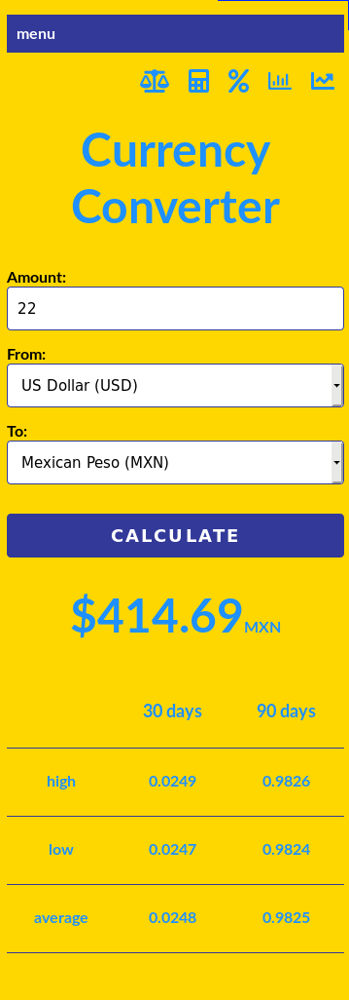
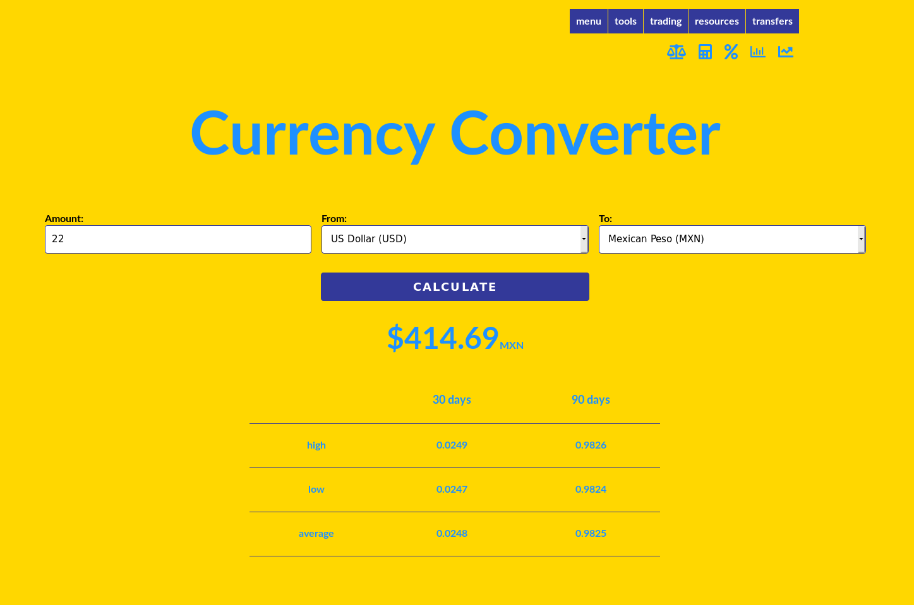

# Javascript Currency Converter

# A mobile first, responsive currency converter using Javascript, HTML, and CSS.

# https://brandon-wallace.github.io/javascriptcurrencyconverter/

# Mobile view

# Desktop view

# License:

This project is licensed under the GPL-3.0 License.
